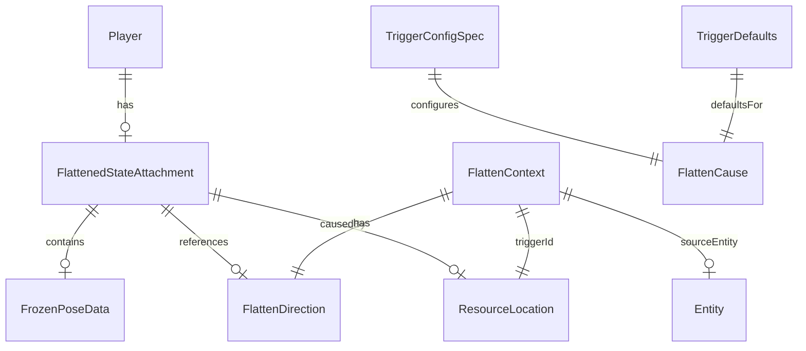

# Software Requirements Specification
## Toon Flattening Mod

**Version:** 0.4.1
**Document Version:** 1.0
**Date:** 2025-12-26
**Standard:** ISO/IEC/IEEE 29148:2018

---

## Table of Contents

1. [Introduction](#1-introduction)
2. [Overall Description](#2-overall-description)
3. [System Features](#3-system-features)
4. [Data Requirements](#4-data-requirements)
5. [External Interface Requirements](#5-external-interface-requirements)
6. [Quality Attributes](#6-quality-attributes)

---

## 1. Introduction

### 1.1 Purpose

This Software Requirements Specification (SRS) documents the functional and non-functional requirements of the Toon Flattening mod for Minecraft. The document serves as a reverse-engineered specification derived from the existing codebase.

### 1.2 Scope

**Product Name:** Toon Flattening
**Mod ID:** `toonflattening`

Toon Flattening is a NeoForge mod that implements cartoon-physics-inspired flattening mechanics in Minecraft. When players are struck by falling anvils, they become compressed into a flattened state with altered dimensions, frozen poses, and restricted movement.

**In Scope:**
- Anvil-triggered player flattening
- Visual scaling via Pehkui integration
- Pose freezing during flattened state
- Movement restriction system
- Reformation mechanic via keybind
- State persistence across sessions
- Client-server synchronization

**Out of Scope:**
- Flattening from non-anvil triggers (planned for future versions)
- Multiplayer entity support (mobs, NPCs)
- Compatibility with specific third-party mods

### 1.3 Definitions, Acronyms, and Abbreviations

| Term | Definition |
|------|------------|
| Flattening | Process of compressing a player entity vertically while expanding horizontally |
| Reformation | Process of returning a flattened player to normal dimensions |
| Trigger | An event that initiates the flattening process |
| Pehkui | Third-party mod providing entity scaling API |
| Tick | Minecraft game loop iteration (20 ticks = 1 second) |
| Attachment | NeoForge persistent data storage mechanism for entities |
| Mixin | Bytecode injection framework for modifying Minecraft classes |
| AABB | Axis-Aligned Bounding Box for collision detection |
| Payload | Network packet data structure |

---

## 2. Overall Description

### 2.1 Product Perspective

Toon Flattening operates as a modification to Minecraft Java Edition via the NeoForge mod loader. It integrates with:

- **Minecraft 1.21.1** - Base game platform
- **NeoForge 21.1.214+** - Mod loader framework
- **Pehkui 3.8+** - Required dependency for entity scaling

The mod functions within Minecraft's client-server architecture, maintaining state consistency between dedicated servers and connected clients.

### 2.2 User Classes and Characteristics

| User Class | Description | Technical Proficiency |
|------------|-------------|----------------------|
| Player | End-user interacting with flattening mechanics | Low - Basic Minecraft familiarity |
| Server Operator | Configures mod settings via TOML files | Medium - Server administration |
| Modpack Developer | Integrates mod with other mods | High - Mod compatibility knowledge |

### 2.3 Operating Environment

| Requirement | Specification |
|-------------|---------------|
| Minecraft Version | 1.21.1 |
| Mod Loader | NeoForge 21.1.214+ |
| Java Version | 21 |
| Required Dependency | Pehkui 3.8+ |
| Sides | Client and Server (requires both) |

### 2.4 Design and Implementation Constraints

| Constraint ID | Description |
|---------------|-------------|
| DC-1 | The system shall use Pehkui API for all entity scaling operations |
| DC-2 | The system shall use NeoForge attachment API for persistent state storage |
| DC-3 | Client-side rendering modifications shall use Mixin injection at priority 1500 |
| DC-4 | Network payloads shall use NeoForge StreamCodec serialization |
| DC-5 | Configuration shall use NeoForge ModConfigSpec with SERVER type |

### 2.5 Assumptions and Dependencies

| ID | Assumption/Dependency | Type |
|----|----------------------|------|
| AD-1 | Pehkui mod is installed and provides ScaleTypes.HEIGHT and ScaleTypes.WIDTH | Dependency |
| AD-2 | Players have standard dimensions of 1.8 blocks height | Assumption |
| AD-3 | Falling anvils are identifiable via BlockTags.ANVIL tag | Assumption |
| AD-4 | Network connectivity allows custom payload transmission | Assumption |
| AD-5 | Client and server run compatible mod versions | Assumption |

---

## 3. System Features

### 3.1 Anvil Flattening Trigger

#### 3.1.1 Description

The system detects falling anvil blocks colliding with players and initiates the flattening process. This trigger handles both survival and creative mode players through direct AABB collision detection.

#### 3.1.2 Functional Requirements

**FR-3.1.1** When a FallingBlockEntity with block state matching BlockTags.ANVIL executes its tick method on the server, the system shall query for Player entities within the anvil's AABB.

**FR-3.1.2** For each player intersecting the anvil's AABB, the system shall invoke FlatteningService.flattenPlayerFromAnvil with the player and anvil entity references.

**FR-3.1.3** The system shall skip flattening processing when the game level is client-side (level.isClientSide() returns true).

**FR-3.1.4** The system shall skip flattening for players in spectator mode.

**FR-3.1.5** The system shall calculate impact velocity as the absolute value of the anvil's Y-axis delta movement.

**FR-3.1.6** The system shall create a FlattenContext with:
- triggerId: `toonflattening:anvil`
- impactVelocity: calculated velocity from FR-3.1.5
- direction: FlattenDirection.DOWN
- sourceEntity: the anvil FallingBlockEntity

**FR-3.1.7** The system shall not deal damage to players with invulnerable abilities (creative mode).

#### 3.1.3 Decision Table: Anvil Trigger Conditions

| Condition | C1 | C2 | C3 | C4 | C5 |
|-----------|----|----|----|----|-----|
| Is server-side | N | Y | Y | Y | Y |
| Block is anvil | - | N | Y | Y | Y |
| Player in AABB | - | - | N | Y | Y |
| Player is spectator | - | - | - | Y | N |
| **Action: Flatten** | No | No | No | No | Yes |

---

### 3.2 Flattening State Management

#### 3.2.1 Description

The system maintains flattened state through entity attachments that persist across game sessions. State includes flattening status, timing, cause, direction, and frozen pose data.

#### 3.2.2 Functional Requirements

**FR-3.2.1** The system shall store flattened state using NeoForge AttachmentType registered with key `toonflattening:flattened_state`.

**FR-3.2.2** The flattened state attachment shall be configured with copyOnDeath enabled.

**FR-3.2.3** The system shall serialize attachment data using FlattenedStateAttachment.CODEC.

**FR-3.2.4** When tryFlattenPlayer is invoked for an already-flattened player (isFlattened = true), the system shall return false without applying effects (first-wins logic).

**FR-3.2.5** When tryFlattenPlayer is invoked for a spectator player, the system shall return false without applying effects.

**FR-3.2.6** The system shall capture FrozenPoseData at the moment of flattening containing:
- yBodyRot: body Y rotation
- yHeadRot: head Y rotation
- xRot: head pitch
- walkAnimPos: walk animation position
- walkAnimSpeed: walk animation speed
- attackAnim: attack animation progress
- swingTime: arm swing timing
- swinging: arm swing active state
- crouching: crouch state

**FR-3.2.7** Upon successful flattening, the system shall update the player's attachment to:
- isFlattened: true
- flattenTime: current game time in ticks
- causeId: the trigger's ResourceLocation
- direction: the flatten direction
- frozenPose: captured FrozenPoseData

#### 3.2.3 State Transition Diagram

```
       ┌─────────────┐
       │   Normal    │
       │(isFlattened │
       │   = false)  │
       └──────┬──────┘
              │ Anvil collision
              │ (valid conditions)
              ▼
       ┌─────────────┐
       │  Flattened  │
       │(isFlattened │
       │   = true)   │
       └──────┬──────┘
              │ Reform key pressed
              │ (server validates)
              ▼
       ┌─────────────┐
       │   Normal    │
       └─────────────┘
```

---

### 3.3 Visual Scaling System

#### 3.3.1 Description

The system applies dimensional transformations to flattened players using the Pehkui scaling API. Flattening compresses height while expanding width to create a cartoon "squashed" appearance.

#### 3.3.2 Functional Requirements

**FR-3.3.1** Upon flattening, the system shall apply height scale via ScaleTypes.HEIGHT.getScaleData(player).setTargetScale().

**FR-3.3.2** Upon flattening, the system shall apply width scale via ScaleTypes.WIDTH.getScaleData(player).setTargetScale().

**FR-3.3.3** The system shall calculate animation duration in ticks using the formula:
```
ticks = PLAYER_HEIGHT / impactVelocity
```
where PLAYER_HEIGHT = 1.8 blocks.

**FR-3.3.4** The calculated animation ticks shall be clamped to range [1, 20].

**FR-3.3.5** When impact velocity is less than 0.01, the system shall use a default animation duration of 10 ticks.

**FR-3.3.6** The system shall set Pehkui scale tick delay to the calculated animation ticks for smooth interpolation.

**FR-3.3.7** Upon reformation, the system shall reset height scale to 1.0.

**FR-3.3.8** Upon reformation, the system shall reset width scale to 1.0.

**FR-3.3.9** Reformation animation shall use reformationTicks from configuration for the scale tick delay.

#### 3.3.3 Animation Tick Calculation Table

| Velocity Range | Calculated Ticks | Applied Ticks |
|----------------|------------------|---------------|
| < 0.01 | N/A (default) | 10 |
| 0.09 | 20.0 | 20 |
| 0.18 | 10.0 | 10 |
| 0.36 | 5.0 | 5 |
| 0.90 | 2.0 | 2 |
| 1.80+ | 1.0 | 1 |

---

### 3.4 Movement Restriction

#### 3.4.1 Description

Flattened players are immobilized and cannot perform movement actions until reformation.

#### 3.4.2 Functional Requirements

**FR-3.4.1** On each server-side entity tick for a flattened player, the system shall set delta movement to Vec3.ZERO.

**FR-3.4.2** On each server-side entity tick for a flattened player, the system shall set onGround to true.

**FR-3.4.3** On each server-side entity tick for a flattened player, the system shall set sprinting to false.

**FR-3.4.4** On each server-side entity tick for a flattened player, the system shall set swimming to false.

**FR-3.4.5** If a flattened player is riding an entity, the system shall invoke stopRiding().

**FR-3.4.6** If a flattened player is elytra-flying, the system shall invoke stopFallFlying().

**FR-3.4.7** On client-side MovementInputUpdateEvent for the local flattened player, the system shall set all Input fields to zero/false:
- leftImpulse: 0.0f
- forwardImpulse: 0.0f
- up: false
- down: false
- left: false
- right: false
- jumping: false
- shiftKeyDown: false

---

### 3.5 Pose Freezing

#### 3.5.1 Description

Flattened players have their visual pose frozen at the moment of impact. The local player retains camera control while their third-person model remains static.

#### 3.5.2 Functional Requirements

**FR-3.5.1** During PlayerRenderer.render() HEAD injection for a flattened player with non-null frozenPose, the system shall override:
- yBodyRot and yBodyRotO to frozenPose.yBodyRot
- yHeadRot and yHeadRotO to frozenPose.yHeadRot

**FR-3.5.2** For the local player, the system shall store original xRot and xRotO values before render.

**FR-3.5.3** During render, the system shall set player xRot and xRotO to frozenPose.xRot.

**FR-3.5.4** For the local player, the system shall restore original xRot and xRotO at PlayerRenderer.render() RETURN injection.

**FR-3.5.5** The system shall override walk animation state:
- walkAnimation.position: frozenPose.walkAnimPos (via accessor)
- walkAnimation.speed: frozenPose.walkAnimSpeed

**FR-3.5.6** The system shall override attack animation:
- attackAnim: frozenPose.attackAnim
- oAttackAnim: frozenPose.attackAnim

**FR-3.5.7** The system shall override swing state:
- swingTime: frozenPose.swingTime
- swinging: frozenPose.swinging

**FR-3.5.8** The system shall override crouch state via setShiftKeyDown(frozenPose.crouching).

---

### 3.6 Squash Visual Effect

#### 3.6.1 Description

A particle burst effect provides visual feedback when a player is flattened.

#### 3.6.2 Functional Requirements

**FR-3.6.1** Upon receiving TriggerSquashAnimationPayload, the client shall invoke SquashAnimationRenderer.playSquashEffect.

**FR-3.6.2** The system shall spawn 25 POOF particles at the player's position.

**FR-3.6.3** Particles shall spawn at Y offset of +1.0 block from player position.

**FR-3.6.4** Particles shall be distributed in a circular pattern using angles calculated as (2 * PI * i) / 25 for i in [0, 24].

**FR-3.6.5** Particle velocity shall be:
- vx: cos(angle) * 0.3
- vy: 0.1
- vz: sin(angle) * 0.3

---

### 3.7 Sound Effect

#### 3.7.1 Description

An audible sound plays when a player is flattened.

#### 3.7.2 Functional Requirements

**FR-3.7.1** Upon flattening, the system shall play sound event `toonflattening:flatten` at the player's position.

**FR-3.7.2** The sound shall play with SoundSource.PLAYERS category.

**FR-3.7.3** The sound shall play with volume 1.0 and pitch 1.0.

**FR-3.7.4** The sound shall have subtitle key `subtitles.toonflattening.flatten`.

---

### 3.8 Reformation System

#### 3.8.1 Description

Players escape the flattened state by pressing a configurable key, which triggers a server-validated reformation process.

#### 3.8.2 Functional Requirements

**FR-3.8.1** The client shall register a KeyMapping with:
- name: `key.toonflattening.reform`
- default key: GLFW.GLFW_KEY_SPACE
- category: `key.categories.toonflattening`

**FR-3.8.2** On each client tick, the system shall check for reform key consumption via consumeClick().

**FR-3.8.3** When the reform key is consumed and the local player is flattened, the client shall send RequestReformPayload to the server.

**FR-3.8.4** Upon receiving RequestReformPayload, the server shall validate the player's flattened state.

**FR-3.8.5** If the player is not flattened, the server shall ignore the reform request.

**FR-3.8.6** Upon valid reform request, the server shall set the player's attachment to FlattenedStateAttachment.DEFAULT.

**FR-3.8.7** Upon valid reform request, the server shall reset Pehkui scale with delay using reformationTicks config value.

**FR-3.8.8** Upon valid reform request, the server shall sync the non-flattened state to all tracking clients.

---

### 3.9 Session Persistence

#### 3.9.1 Description

Flattened state persists across player login/logout and respawn events.

#### 3.9.2 Functional Requirements

**FR-3.9.1** On PlayerLoggedInEvent, if the player's persisted state has isFlattened = true:
- The system shall restore Pehkui scale using trigger config values
- The system shall sync flattened state to the client

**FR-3.9.2** On PlayerLoggedInEvent, if the player's persisted state has isFlattened = false:
- The system shall reset Pehkui scale to 1.0
- The system shall sync non-flattened state to the client

**FR-3.9.3** On PlayerRespawnEvent:
- The system shall reset attachment to DEFAULT
- The system shall reset Pehkui scale to 1.0
- The system shall sync non-flattened state to clients

**FR-3.9.4** On ServerStartingEvent, the system shall reset all connected players to DEFAULT state.

---

### 3.10 Network Synchronization

#### 3.10.1 Description

Flattened state and visual effects are synchronized between server and clients via custom payloads.

#### 3.10.2 Functional Requirements

**FR-3.10.1** The system shall register three payload types with registrar version "1":
- SyncFlattenStatePayload (playToClient)
- TriggerSquashAnimationPayload (playToClient)
- RequestReformPayload (playToServer)

**FR-3.10.2** SyncFlattenStatePayload shall contain:
- playerId: int (VAR_INT encoded)
- isFlattened: boolean
- flattenTime: long (VAR_LONG encoded)
- causeId: Optional<ResourceLocation>
- direction: Optional<FlattenDirection>
- frozenPose: Optional<FrozenPoseData>

**FR-3.10.3** SyncFlattenStatePayload shall be sent via PacketDistributor.sendToPlayersTrackingEntityAndSelf.

**FR-3.10.4** TriggerSquashAnimationPayload shall contain playerId as VAR_INT.

**FR-3.10.5** RequestReformPayload shall be an empty unit payload.

**FR-3.10.6** Upon receiving SyncFlattenStatePayload, the client shall update the target player's attachment.

---

## 4. Data Requirements

### 4.1 Logical Data Model



### 4.2 Data Dictionary

#### 4.2.1 FlattenedStateAttachment

| Field | Type | Constraints | Description |
|-------|------|-------------|-------------|
| isFlattened | boolean | Required | Whether player is in flattened state |
| flattenTime | long | Required, >= 0 | Game tick when flattening occurred |
| causeId | ResourceLocation | Nullable | Trigger identifier (e.g., toonflattening:anvil) |
| direction | FlattenDirection | Nullable | Direction of flattening force |
| frozenPose | FrozenPoseData | Nullable | Captured pose at flatten moment |

**Default Value:** `FlattenedStateAttachment(false, 0L, null, null, null)`

#### 4.2.2 FrozenPoseData

| Field | Type | Constraints | Description |
|-------|------|-------------|-------------|
| yBodyRot | float | Required | Body Y rotation in degrees |
| yHeadRot | float | Required | Head Y rotation in degrees |
| xRot | float | Required | Head pitch in degrees |
| walkAnimPos | float | Required, >= 0 | Walk animation position |
| walkAnimSpeed | float | Required, >= 0 | Walk animation speed |
| attackAnim | float | Required, [0.0, 1.0] | Attack animation progress |
| swingTime | int | Required, >= 0 | Arm swing tick counter |
| swinging | boolean | Required | Arm swing active state |
| crouching | boolean | Required | Crouch state |

#### 4.2.3 FlattenContext

| Field | Type | Constraints | Description |
|-------|------|-------------|-------------|
| triggerId | ResourceLocation | Required, non-null | Unique trigger identifier |
| impactVelocity | double | Required, >= 0 | Velocity at impact in blocks/tick |
| direction | FlattenDirection | Required, non-null | Direction of flattening force |
| sourceEntity | Entity | Nullable | Entity that caused the flattening |

#### 4.2.4 FlattenDirection

| Value | Serialized Name |
|-------|-----------------|
| DOWN | "down" |
| UP | "up" |
| NORTH | "north" |
| SOUTH | "south" |
| EAST | "east" |
| WEST | "west" |

#### 4.2.5 FlattenCause

| Value | Description |
|-------|-------------|
| ANVIL | Falling anvil trigger |

#### 4.2.6 TriggerConfigSpec

| Field | Type | Range | Default (ANVIL) |
|-------|------|-------|-----------------|
| enabled | boolean | true/false | true |
| damage | double | [0.0, 20.0] | 4.0 |
| heightScale | double | [0.01, 1.0] | 0.05 |
| widthScale | double | [1.0, 6.0] | 1.8 |

#### 4.2.7 Global Configuration

| Field | Type | Range | Default |
|-------|------|-------|---------|
| reformationTicks | int | [1, 100] | 5 |

---

## 5. External Interface Requirements

### 5.1 User Interfaces

#### 5.1.1 Keybind Interface

| Keybind | Default | Category | Action |
|---------|---------|----------|--------|
| Reform from Flattened | SPACE | Toon Flattening | Request reformation |

#### 5.1.2 Visual Feedback

| Feedback Type | Description |
|---------------|-------------|
| Player Scaling | Height compressed to 5%, width expanded to 180% |
| Particle Effect | 25 POOF particles in circular burst |
| Pose Freeze | Player model static in last pose before impact |

### 5.2 Hardware Interfaces

Not applicable. The mod operates entirely within Minecraft's software abstraction layer.

### 5.3 Software Interfaces

#### 5.3.1 Pehkui Integration

| Interface | Method | Parameters | Description |
|-----------|--------|------------|-------------|
| ScaleTypes.HEIGHT | getScaleData(Entity) | Entity | Retrieves height scale data |
| ScaleTypes.WIDTH | getScaleData(Entity) | Entity | Retrieves width scale data |
| ScaleData | setTargetScale(float) | Scale value | Sets target scale |
| ScaleData | setScaleTickDelay(int) | Tick count | Sets animation duration |

#### 5.3.2 NeoForge APIs

| API | Usage |
|-----|-------|
| AttachmentType | Persistent entity data storage |
| ModConfigSpec | Server-side configuration |
| CustomPacketPayload | Network communication |
| EventBusSubscriber | Event handling |
| Mixin | Bytecode modification |

#### 5.3.3 Minecraft APIs

| API | Usage |
|-----|-------|
| FallingBlockEntity | Anvil detection |
| BlockTags.ANVIL | Anvil block identification |
| Player | Target entity for flattening |
| SoundEvent | Audio feedback |
| ParticleTypes.POOF | Visual feedback |
| KeyMapping | Input handling |

### 5.4 Communications Interfaces

#### 5.4.1 Network Payloads

| Payload | Direction | Type ID |
|---------|-----------|---------|
| SyncFlattenStatePayload | Server -> Client | toonflattening:sync_flatten_state |
| TriggerSquashAnimationPayload | Server -> Client | toonflattening:trigger_squash_animation |
| RequestReformPayload | Client -> Server | toonflattening:request_reform |

---

## 6. Quality Attributes

### 6.1 Performance

| ID | Attribute | Specification |
|----|-----------|---------------|
| PERF-1 | Tick Processing | PlayerMovementHandler shall process each flattened player in O(1) time per tick |
| PERF-2 | Mixin Priority | PlayerRendererMixin operates at priority 1500 to allow other mods lower priority |
| PERF-3 | Network Efficiency | Payloads use VAR_INT/VAR_LONG encoding for compact wire format |
| PERF-4 | Particle Count | Squash effect limited to 25 particles per flattening event |

### 6.2 Reliability

| ID | Attribute | Specification |
|----|-----------|---------------|
| REL-1 | State Persistence | Flattened state survives player disconnect/reconnect via attachment serialization |
| REL-2 | First-Wins Logic | Concurrent flattening attempts are rejected for already-flattened players |
| REL-3 | Server Authority | Reformation requests validated server-side; clients cannot force state changes |
| REL-4 | Death Reset | Flattened state resets on respawn (RespawnHandler) |
| REL-5 | Server Start | All player states reset on server start to ensure clean state |

### 6.3 Security

| ID | Attribute | Specification |
|----|-----------|---------------|
| SEC-1 | Server Validation | RequestReformPayload handler validates isFlattened before processing |
| SEC-2 | Creative Mode | Damage bypassed for players with invulnerable abilities |
| SEC-3 | Spectator Mode | Spectators explicitly excluded from flattening |

### 6.4 Compatibility

| ID | Attribute | Specification |
|----|-----------|---------------|
| COMP-1 | Mod Dependency | Requires Pehkui 3.8+ for scaling functionality |
| COMP-2 | Minecraft Version | Targets Minecraft 1.21.1 (version range: [1.21]) |
| COMP-3 | NeoForge Version | Requires NeoForge 21.1.214+ |
| COMP-4 | Java Version | Requires Java 21 runtime |
| COMP-5 | Mixin Compatibility | Uses JAVA_21 compatibility level, priority 1500 for rendering mixin |

### 6.5 Configurability

| ID | Attribute | Specification |
|----|-----------|---------------|
| CONF-1 | Configuration Type | SERVER config (toonflattening-server.toml) |
| CONF-2 | Hot-Reload | Trigger configurations support hot-reloading without restart |
| CONF-3 | Per-Trigger Settings | Each FlattenCause has independent enabled, damage, height/width scale |
| CONF-4 | Reformation Timing | Global reformationTicks controls reformation animation speed |

---

## Appendix A: Configuration File Structure

```toml
[flattening]
    # Animation duration for reformation in ticks (20 = 1 second)
    # Range: 1 ~ 100
    reformationTicks = 5

[triggers]
    [triggers.anvil]
        # Enable ANVIL trigger
        enabled = true
        # Damage dealt by ANVIL
        # Range: 0.0 ~ 20.0
        damage = 4.0
        # Height scale for ANVIL
        # Range: 0.01 ~ 1.0
        heightScale = 0.05
        # Width scale for ANVIL
        # Range: 1.0 ~ 6.0
        widthScale = 1.8
```

---

## Appendix B: Unresolved Questions

1. Future triggers (wall collision, piston, etc.) - architecture ready but not implemented?
2. FlattenDirection values UP/NORTH/SOUTH/EAST/WEST - intended use cases?
3. Trigger config hot-reload - tested under production conditions?
4. copyOnDeath behavior - should death reset state instead of preserving?
5. Multi-trigger collision same tick - desired behavior?
6. Pehkui version compatibility ceiling - tested with versions > 3.8.3?
